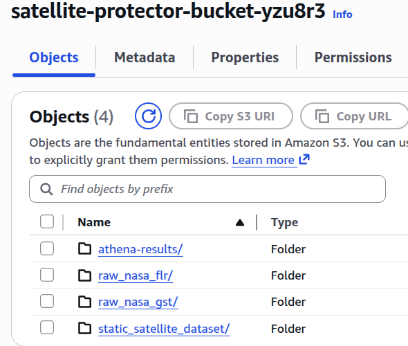
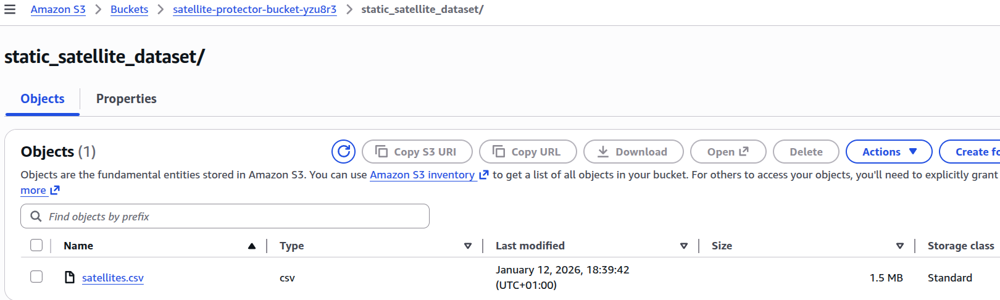
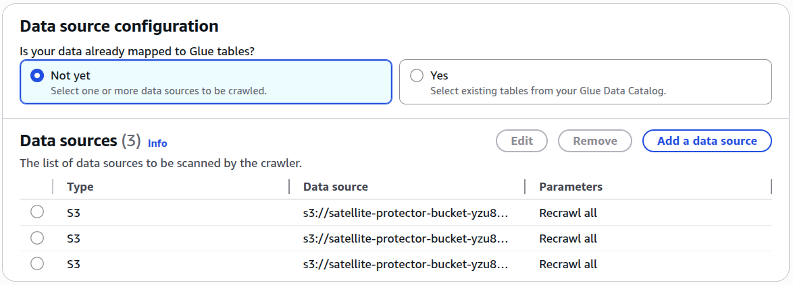
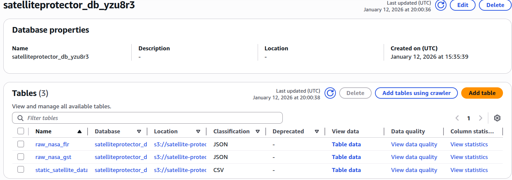

# Business Value and Use Case for the AWS Data Pipeline Satellite Damage Protection Project

## Business Value
This AWS Data Pipeline Satellite Damage Protection project provides significant business value to satellite operators, such as NASA, by enhancing the safety and longevity of their satellite assets. Satellites commonly face threats from space weather events like Solar Flares, Geomagnetic Storms, and Coronal Mass Ejections (CMEs). The repair of such assets is often costly, time-consuming, or outright impossible. By leveraging AWS services to create a robust data pipeline, the project enables real-time monitoring and analysis of satellite telemetry data, which is crucial for predicting and preventing potential damage from space weather events and other environmental factors. Key business values includes:
1. **Risk Mitigation**: By analyzing satellite telemetry data, operators can identify potential threats and take proactive measures to avoid or minimize risks, which reduces the probability of satellite damage and mission failure.
2. **Cost Savings**: Preventing satellite damage through early detection and intervention can lead to significant cost savings by avoiding expensive repairs or replacements.
3. **Enhanced Decision-Making**: Access to real-time data and insights empowers operators to make informed decisions regarding satellite operations and maintenance.

## Use Case
The main use case for this project is to monitor and protect satellites from potential damage caused by space weather events, specifically solar flares and geomagnetic storms. The project utilizes publicly available satellite telemetry data from sources like the Union of Concerned Scientists and NASA's DONKI API.

# KPIs to Measure Success
In order to measure the success of the created architecture and data pipeline, the following Key Performance Indicators (KPIs) were considered:
1. **Risk Identification Speed**
    - *Metric*: Time taken to query satellites at risk after strong GST detections.
    - *Target Goal*: Less than 1-5 minutes from detection to risk identification.
2. **Data "Freshness"**
    - *Metric*: Time lag between data ingestion from NASA DONKI API and availability in Athena for querying.
    - *Target Goal*: Data available for querying within 5-10 minutes of ingestion.
3. **Ingestion Success Rate**
    - *Metric*: Percentage of successful data ingestions from NASA DONKI API to S3 bucket.
    - *Target Goal*: 99.9%, ~100% successful ingestions. There is no room for failure in a production environment.

# Outline and Steps Taken in the Project


*Created using Mermaid Live Editor*

## 1. Data Ingestion
1. **UCS Satellite Database**: The project begins by ingesting satellite telemetry data from the UCS Satellite Database, which provides detailed information about various satellites, including their operational status and orbital parameters. This is the static dataset that serves as a reference for satellite information.
    - The Excel file downloaded from the UCS website was converted to CSV format for easier processing. The process will not be discussed in detail here.
    - S3 was used to store the static UCS Satellite Database CSV file and create folders for other incoming data.
    
    

2. **NASA DONKI API**: Real-time space weather data from NASA's DONKI API was also ingested, which provides information about solar flares, geomagnetic storms, and other space weather events that could potentially impact satellite operations.

3. **AWS Lambda**: An AWS Lambda function was created to automate the data ingestion process from the APIs. The function fetches data from the UCS Satellite Database and NASA's DONKI API, specifically the ones concerned with Solar Flares and Geomagnetic Storms, daily and stores it in designated folders inside the project S3 bucket.
    - The Lambda function was scheduled to run daily using Amazon EventBridge to ensure that the data remains up-to-date and new data is appended regularly.
    - To check the code as `Python` file, please refer to `code/space_weather_lambda_function.py`.
    ```python
    import urllib.request
    import json
    import boto3
    from datetime import datetime

    # Config:
    API_KEY = "ZoIR3ASieEkYkcd02Cj7Jx2TMxqwJxh6hFekHvUk" # NOT SAFE TO HARD CODE IN PRODUCTION! 
    # irl this should be stored in AWS Secrets Manager or as an encrypted environment variable
    # for the sake of simplicity in this example I will hardcode it here

    DESTINATION_BUCKET = "satellite-protector-bucket-yzu8r3"

    # Mapping of data types to S3 folders
    DESTINATION_FOLDERS = {
        "GST": "raw_nasa_gst/",  # Geomagnetic Storms (The Impact), abbreviated as GST
        "FLR": "raw_nasa_flr/"   # Solar Flares (The Warning), abbreviated as FLR
    }

    def lambda_handler(event, context):
        
        results = []
        s3_client = boto3.client('s3') # initializing S3 client using boto3 to not do it twice in the loop
        today_str = datetime.now().strftime("%Y-%m-%d") # getting only today's date in yyyy-MM-dd format to use in API request
        timestamp = datetime.now().strftime("%Y%m%d_%H%M%S")

        print(f"Starting data ingestion for date: {today_str}")

        for point, folder in DESTINATION_FOLDERS.items():
            
            try:
                # Fetching space weather data from NASA DONKI API
                url = f"https://api.nasa.gov/DONKI/{point}?startDate={today_str}&endDate={today_str}&api_key={API_KEY}" 
                with urllib.request.urlopen(url) as response:
                    if response.status != 200:
                        raise Exception(f"API fetching failed: {response.status} - {response.reason}")
                    data = json.loads(response.read().decode('utf-8')) # decodes bytes to string before loading in JSON format

                if not data:
                    print(f"No data retrieved from NASA API for endpoint {point} on date {today_str}.")
                    results.append(f"{point}: No data today ({today_str}).")
                    continue  # skipping to the next point if no data is returned

                print(f"Successfully retrieved {len(data)} records from NASA API for endpoint {point} on date {today_str}.")

                # Preparing the upload file to S3
                if point == "GST":
                    file_name = f"nasa_gst_{timestamp}.json"
                elif point == "FLR":
                    file_name = f"nasa_flr_{timestamp}.json"
                else:
                    raise Exception(f"Unknown endpoint: {point}")
                s3_path = f"{folder}{file_name}"

                # Uploading data to S3
                # first, converting the list of JSON objects into "Newline Delimited JSON" (NDJSON)
                # this is needed as it removes the outer [ ] and puts each record on a new line
                ndjson_data = "\n".join([json.dumps(record) for record in data])

                s3_client.put_object(
                    Bucket=DESTINATION_BUCKET,
                    Key=s3_path,
                    Body=ndjson_data, # using NDJSON data for the body
                    ContentType='application/x-ndjson' # setting content type for NDJSON
                )

                print(f"Data has been successfully uploaded to s3://{DESTINATION_BUCKET}/{s3_path}")
                results.append(f"Successfully uploaded {len(data)} records to {s3_path} in bucket {DESTINATION_BUCKET}.")
            
            except Exception as e:
                print(f"ERROR for {point}: {str(e)}")
                results.append(f"ERROR processing {point}: {str(e)}") # logging error message
                raise e  # raise exception for AWS to capture the failure and abort execution

        return {
            'statusCode': 200,
            'body': json.dumps(results) # returning results (both) as JSON string
        }
    ```
    - **API key** was not hidden for the case ofsimplicity and for the fact that this is a **free** public API with limited usage. In production, it should be stored securely using AWS Secrets Manager or as an encrypted environment variable!
    - Requirements are also indicated in `code/requirements.txt`.
    - The code does not use Lambda Layers as no such "outside" libraries are needed beyond `boto3` and standard Python libraries. 
    - The code above fetches data from the NASA DONKI API for Geomagnetic Storms (GST) and Solar Flares (FLR) daily (as of EventBridge), processes it into Newline Delimited JSON (NDJSON) format, and uploads it to designated folders in the S3 bucket.

## 2. Data Processing
1. **AWS Glue**: AWS Glue was employed to create a data catalog and process the ingested data using a Crawler. The Glue Crawler was set up to automatically discover the schema of the incoming data and create tables in the AWS Glue Data Catalog. This allows for easy querying and analysis of the data using AWS Athena.
    
    
    *Database with the tables created by the Glue Crawler*

## 3. Querying and Analysis
1. **AWS Athena**: AWS Athena was used to query the processed data stored in the AWS Glue Data Catalog. This enables satellite operators to analyze the data and gain insights into potential threats from space weather events.
    - Sample Athena queries were created, these can be found in the `code/sql_athena_queries.sql` file in greater detail. For the analysis and showcase of results refer to the `Results of Query Analysis.md` file.

# Cost Estimation and Budgeting
This project was designed with the strict budget of **$50** at **LearnerLab**, **AWS Academy**. By utilizing a *Serverless architecture* (Lambda, Glue, Athena), the actual costs are almost negligible, since some services even fall under the free tier.

| Service | Configuration | Estimated Monthly Cost |
| :--- | :--- | :--- |
| **AWS Lambda** | 512MB Memory, Daily execution, ~2-15s runtime/execution | **$0.00** (Free Tier) |
| **Amazon S3** | Standard Storage (< 1GB text data), scales with usage | **$0.02** |
| **AWS Glue** | 1 Crawler (2 DPUs, runs daily) | **$0.51 - $2.50** |
| **Amazon Athena** | Scanning <= 10MB data per query | **<$0.01, ~$0.00** |
| **Amazon EventBridge**| Scheduled Rule | **$0.00** |
| **Total** | | **$0.53 - $2.53 / month** |

*The primary cost driver is the AWS Glue Crawler, which has a minimum billing unit of 10 minutes per run. Even with this, the project remains well within the $50 budget.*

# Possible Future Considerations and Enhancements of the Project

1. **API key handling**: In a production environment, the API key used to access NASA's DONKI API should be securely stored using AWS Secrets Manager or as an encrypted environment variable rather than being hardcoded in the Lambda function. 
2. **Machine Learning Integration**: Future enhancements could include integrating machine learning models to predict satellite damage based on historical telemetry data and space weather patterns. AWS SageMaker could be used via Data Scientist collaboration.
3. **Real-Time Alerts**: Real-time alert system could potentially be implemented using an AWS service to notify satellite operators of imminent threats based on the analyzed data or predictive models.
4. **Expanded Data Sources**: Incorporating additional data sources, such as ground-based observations or other satellite data, to enhance the accuracy and comprehensiveness of the analysis.
5. **Dashboard Visualization**: Creating dashboards and/or visualizations using either an Amazon service or Tableau, PowerBI to visualize the data and insights for easier interpretation by satellite operators and business managers.